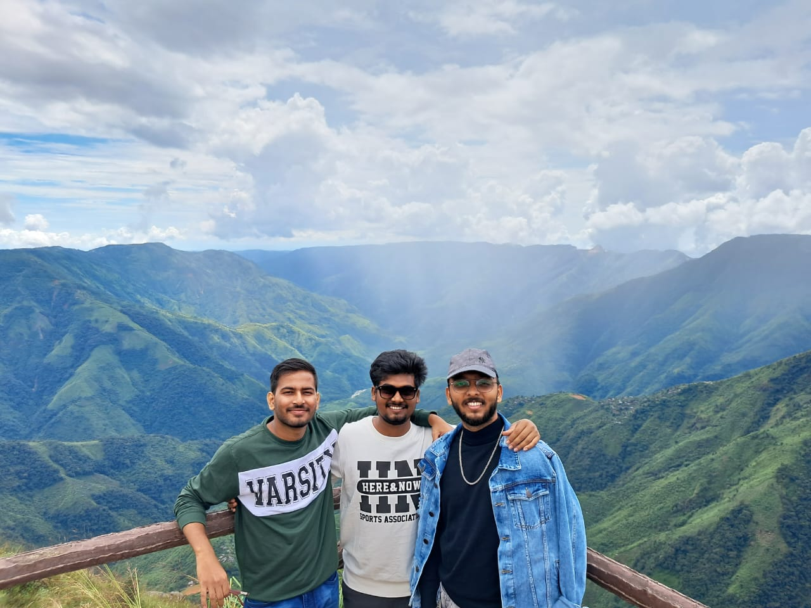
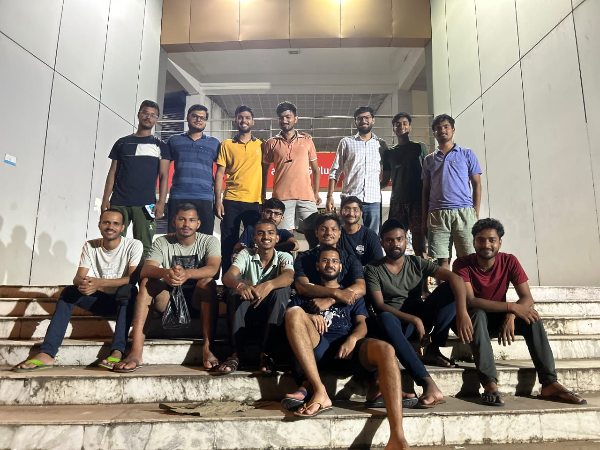
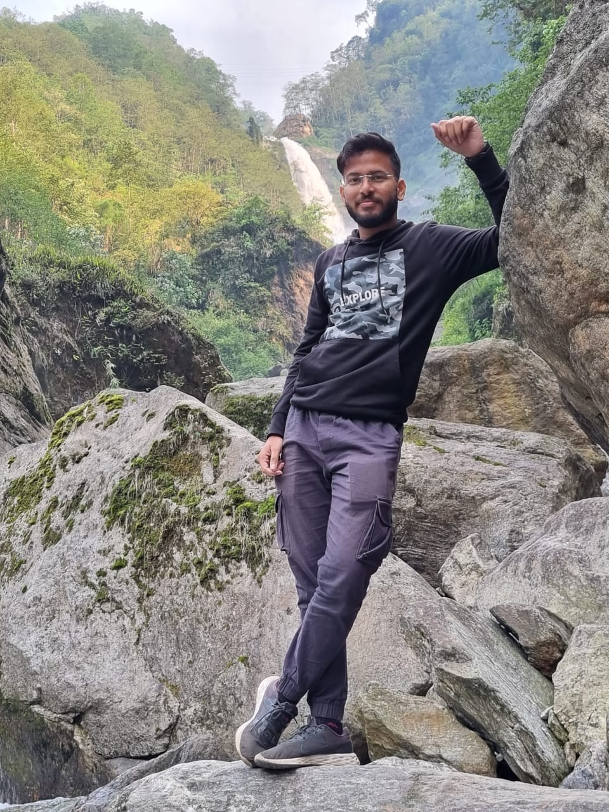
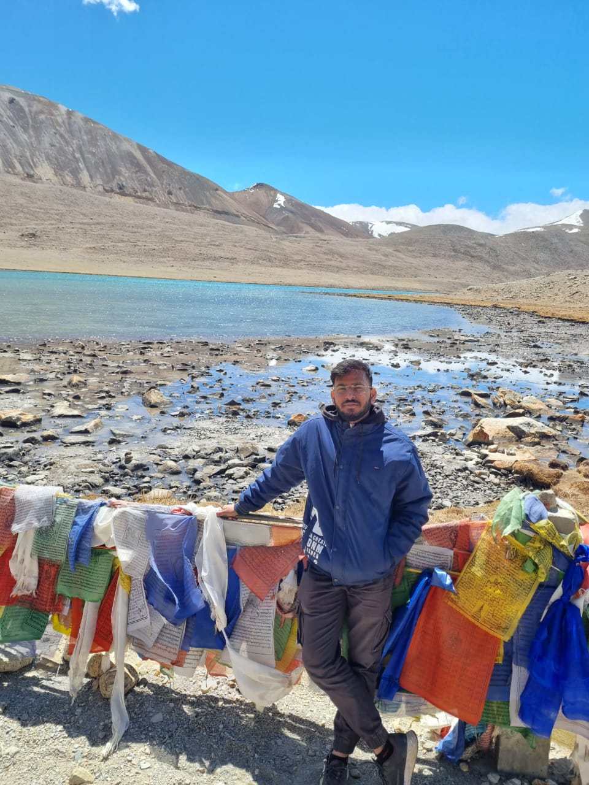
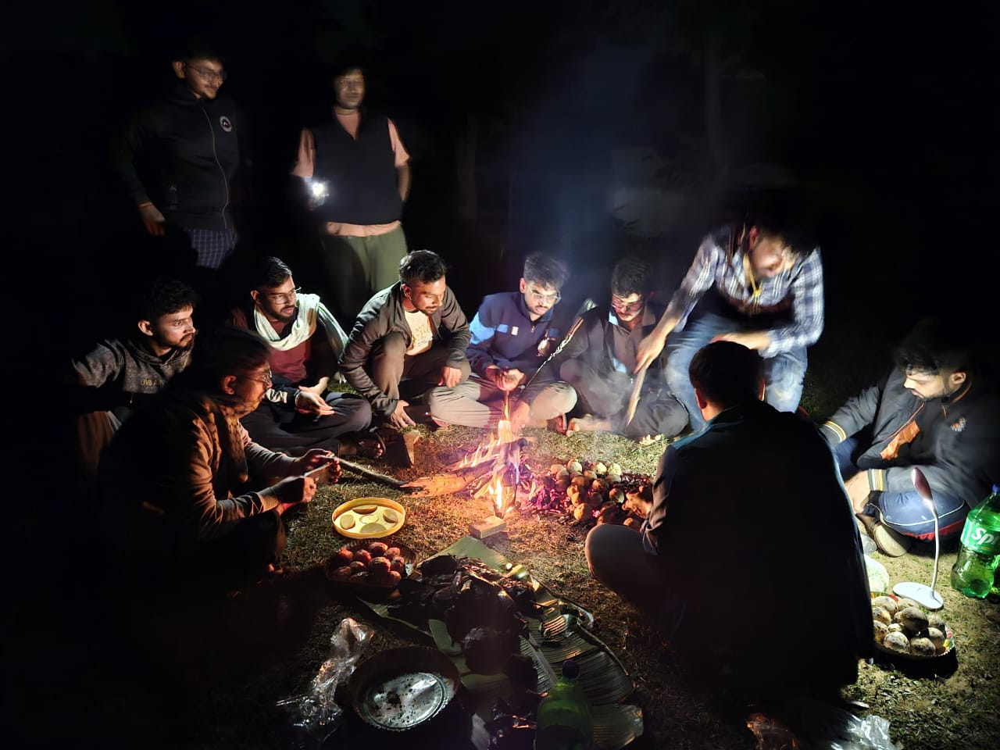

This is Nabh Kumar, a Mechanical Engineering graduate from NIT Agartala's 2025 batch, currently placed at Vedanta. This is my story - a journey through struggles, discoveries, friendships, and the transformation that happens when a village boy meets the world of engineering. It's a collection of memories, lessons, and experiences that shaped me over four transformative years.

My journey begins in a remote village in Bihar - so remote that electricity only arrived in 2018. When I was three, my father, an Army man, moved our family to Danapur cantonment, where I was enrolled in Army Public School. Both my parents completed their education till matriculation, with my father serving in the Army and my mother as a housewife. I'm the first engineer not just in my family, but in my entire village - a fact I'm proud of, though it came with the challenge of having no guidance or backup.
Until fifth grade, I was thoroughly average, sitting on the last bench and playing with friends. This changed in sixth grade when a senior's tuition helped me achieve first rank - marking the beginning of my academic transformation. Around this time, I discovered football, pursuing it seriously from class 8th onwards. I won the inter-house tournament three times, but this singular focus cost me - I failed a class 9th interview due to lack of portfolio diversity.

Class 9th became my turning point. I understood what teachers expected, topped the class, and developed a diverse activity portfolio. In class 10th, I was made Captain of Nalanda House - an even better position than the CCA Captain role my sister had held. It was then I first heard about IIT-JEE, though I was reluctant. Coming from an Army background, success meant becoming an Army officer - that was my only definition, we are, together.

 While friends left for Kota coaching centers, I stayed in school, becoming Vice Prefect in class 11th. Then came devastating news - I had hyperhidrosis, permanently disqualifying me from Army service. My dream shattered, I didn't know what to do. I had chosen Science for NDA, but with that door closed, I pursued basic IIT coaching to find direction.

In class 12th, I changed to an engineer-turned-teacher who showed me IIT-JEE wasn't impossibly tough. I could solve advanced questions, so I decided to give it a chance, thinking it was the closest to defence - perhaps leading to DRDO, ISRO, or Engineering Services.

Academically, I remained average throughout school, never crossing 85-86 except my class 12th boards where I scored 92. When lockdown hit, I was planning Kota for a dropper batch, but my Computer Science exam was cancelled. Like everyone, I was clueless about online classes. In August, I discovered online coaching and joined, completing most of my syllabus in five months from August to January. With four JEE attempts that year, my third attempt yielded a decent percentile - enough for Mechanical Engineering.
My first day was an online class. We were the second batch starting with online education, making me nervous since no one could predict how engineering would unfold. Initially, there was no senior contact. When we finally met immediate seniors online, we introduced ourselves in the basic school way, unaware of proper college protocols.
During first semester, I was an ideal student - mainly because I didn't know you could bunk classes, even online ones. I gave mid-semester exams honestly alone, but end-semester was different. That's when I met section friends who shaped my college personality. Everyone collaborated in online exams, but since I wasn't in any group initially, I was left out. One friend helped me join a group meeting every evening through video calls - friends who are still with me today.
When we physically came to college, I already knew many friends. We were on the same floor with same classes, so things flowed naturally. We had valuable interactions with super-seniors from the 2018 batch who stayed only one month but taught us college life, customs, and traditions. They commanded such respect that entire roads would clear when they called someone.

I joined the Aero Club from the online batch itself, fascinated by aerospace and desiring to join ISRO - why I had chosen Mechanical Engineering as my first preference in JoSAA counselling. When I came to college, I was selected again in the offline interview process. I stayed about one and a half years but eventually left due to lack of expected satisfaction or engagement.

One highlight was a Boeing competition for aircraft design where our team was selected for the first round at IIT Kharagpur. Unfortunately, delivery issues with aircraft parts - the shipment arrived a day after we left - prevented us from participating in the second round despite everyone's hard work.

The club provided valuable early exposure to SolidWorks and ANSYS, officially taught in sixth semester but I learned in first year. This became a key resume highlight and helped tremendously in later projects. I was also in E-Baha selection process, even securing first rank in an online quiz, but backed off to focus on Aero Club.
In first year, I decided to join the gym. I had an injury preventing football continuation, and COVID had caused weight gain. A friend influenced this decision, and I've been consistent since - one of the best college pursuits. Managing both gym and Mechanical Engineering's significantly heavier curriculum taught me valuable time management skills.

Second year marked an important personal moment - my first trip with friends in my entire life. During Navratri, after seeing pandals one day, two friends and I left for Meghalaya the next morning. That trip became a core memory, and since then, traveling has remained something really close to me - my way of resetting whenever I feel low or stuck.

By third semester's end, I went on my first solo trip to Gujarat directly from college without any fixed plan. I didn't have proper contacts, and though a relative lived there, I couldn't stay at their place. I followed instinct, visited desired places, and returned the next day. On the way back, I randomly talked to someone from Bihar who turned out to be a well-known personality's son. He invited me to his hostel and arranged overnight stay. This experience opened up my confidence and strengthened my love for solo travel.

Fourth semester was chaotic as even semesters are generally shorter. Small cultural festivals occurred, and I went to IIT Kharagpur, exposing me to different college cultures - how vibrant and different their environments were, making me think about improvements for our own college.

Third year was honestly a dark memory, especially in Mechanical Engineering where it's considered the worst year due to academic load. While other branches handled around 8 subjects, we dealt with 12-13 subjects. We had six labs with only five working days - every single day completing one lab, writing reports at night, submitting next morning, and repeating the cycle. However, one positive was our first academic project - a minor project teaching research basics, literature reading, and idea formulation.
For internship, I went to Steel Authority of India (SAIL), Bokaro Steel Plant, but honestly, it wasn't pleasant. First problem was accommodation - Bokaro is like a mini-town where finding short-term stay was challenging since landlords preferred long-term students. The internship wasn't structured with no proper guidance or mentorship.
However, it was good for learning how industry actually works versus textbooks. Seeing concepts like hydraulic force applied in massive industrial systems was eye-opening. One mill complex was about 6,700 meters long - standing there for the first time was overwhelming for someone who had never seen industry from inside. It gave realistic glimpse of potential futures, though I was relieved when those 28 days ended.

My final year wasn't about classes - I attended a number fitting in single digits. But emotionally and mentally, it was intense and transformative, coming with lots of uncertainty, especially around placements. At placement season's beginning, I was actually reluctant to participate, feeling I might take a different route. But friends insisted I at least appear for some placements.

The first company I cleared online assessment for was Ashok Leyland - also my first college group discussion. I cleared the GD round but no mechanical students were selected in final interviews, which was disappointing. Second company was Linde India, scheduled for January 4th. I was mentally prepared, hoping this might be it, but again only two students were sent to final round and I was rejected.

Finally, Vedanta came. I was calm but hopeful, telling myself this had to be the last interview. Having done GDs in previous interviews, I felt comfortable and confident. During final interview, I was lucky - questions were mostly basic and happened to be exactly what I had predicted and prepared thoroughly. When results were announced, my name was on the list, and I got placed at Vedanta.

I got placed just two months before college ended, and it wasn't easy watching everyone move forward while I was stuck in the process. Every time someone cracked an interview and I didn't, it stung - not from jealousy, but knowing how hard everyone had worked, yet it all boiled down to a 20-30 minute interview. This pressure taught me resilience, patience, and faith in myself and the process.

It would be a crime not to talk about my friends - they've been the most important part of my college journey. If someone asked what truly made my four years memorable, it's them. Every single moment of fun, stress, growth, and learning had their presence. Friends were more than classmates - they were hangout buddies, travel partners, and support system. Whenever I felt low, overwhelmed, or stressed, I'd just go out with them, and that was enough to make things better.

From first year, there's Vipul, Himanshu, and my roommate Rohit. Chaitanya played a huge role - he's why our group was running. Later in college, I became close to Rachit, Akshat, Rohit , Titto , Ashutosh and Arnav - Arnav had one of the deepest impacts on me. Then there's Saurabh, who truly defined "Work in silence, let success make the noise." Many juniors don't even know him by name, but he quietly cracked GSoC in third year, got Cisco internship in final year, received PPO, left it, and then cracked Cloudera placement - all without ever boasting.

These friends taught me how to handle pressure, ask for help when needed, communicate better, and carry myself in the outside world. They're the reason behind the person I am today - not just as a student, but as someone ready for the real world.

Our hangout spots evolved each year. First year was TSR - our safe space where seniors weren't around much. Second year was roaming campus with Praveen, my gym partner who made me take fitness seriously. We'd chill at Amul with tea for hours. Third year became floor bonding with friends on the same hostel floor and Shopping Complex visits. By final year, the Shopping Complex became full ritual - sharp 6:00 PM calls would come to go there, becoming our daily routine. For peaceful moments or heart-to-heart talks, the walkway near Director's bungalow was perfect for long walks.

The defining moments of these four years were many. First, I met friends who became guiding lights. Coming from a background where no one in my family was in engineering, I found people who gave me the best advice and support. When I joined, I was shy and didn't know how to talk to new people properly, but now I feel much more confident initiating conversations and collaborating openly.

Travel experiences were equally defining. I've now visited four northeastern states and am about to visit the fifth. Every trip added something new to my perspective about life, independence, and myself. Joining clubs, working with teams, and getting exposure to different colleges also played big roles in shaping who I am today. When I interacted with students from IITs and other top institutions, I realized how different their practices, opportunities, and approaches were. It was eye-opening and made me rethink my goals and approach to learning.

Regarding finances and travel, I didn't have scholarships, so whatever money I had was from my father. I saved little by little from monthly allowance and would ask for extra when trips came up. I had to be smart - traveling was priority, so I'd cut expenses elsewhere. Instead of ordering food frequently, I'd eat in mess and save money. Over 4-5 months, saving ₹500-1000 per month would add up to ₹2500-5000, enough for budget trips if planned wisely.

There definitely is peer pressure in engineering, especially regarding coding and circuital branches during placements. In first year itself, many students from my section shifted to CS or EC. Many were deeply into coding, staying up until 3-4 AM preparing DSA and Leet-code, while I used to sleep peacefully by 11 PM. For me, there was no such pressure because I was clear from the start that I wanted mechanical engineering. I chose it and wanted to do something meaningful in it.

One of the best lessons I've learned is not to take anything too seriously. If you succeed, it doesn't mean you're extraordinarily special - it just means you worked hard and your luck aligned with your efforts. Similarly, if you face failure, it doesn't mean you're not capable - there's just something you need to improve. Maybe someone else had that extra edge this time. Work on your weaknesses, and you'll get your chance too.

The key is staying balanced. Don't let success take you to the seventh sky, and don't let failure drag you into the ground. Stay grounded in both situations. Celebrate your success but also analyse your failures to learn and grow from them. As Buddha said, "The middle path is the way to peace and happiness."

After securing good placement at Vedanta, which offers one of the best initial packages in the industry for mechanical graduates, my focus is to go there, gain experience, and contribute to the best of my abilities. I want to start my professional journey, see how it goes, and then make decisions about future government exams or higher studies based on how things unfold.

My advice to juniors is simple: don't stay locked in your rooms thinking that studying alone will get you good placements. Even if you get placed, you'll need to survive the corporate world where you'll have less time for family and work both. Come out and see how you can utilize the time you're wasting - often just scrolling phones. Check your screen time and see how much is irrelevant. Use that time productively - go for a run, join a club, develop a hobby. I learned guitar during college. Ask friends to teach you something they know. That's how you can manage time effectively.

Mechanical engineering is honestly a bit tougher - not because subjects are more difficult, but because of how they're structured. The real challenge lies in volume: more subjects, more classes, and often more lab work compared to other branches. My advice is don't leave everything for the end. Even if you study just five hours a week, do it consistently. Many topics involve derivations and conceptual clarity that you can't cram before exams.
Learn new skills seriously - many students think SolidWorks or MATLAB don't help in placements, but they're wrong. These are industry-relevant tools, especially in design and manufacturing roles. If you really learn them, they become lifelong assets. Join a club but choose wisely - a good club with hands-on projects teaches you far more than textbooks ever will.

Don't fall into the Instagram trap of fancy vacations - travel smart and economically. Stay in hostels, take public transport, travel off-season. The experience will still be amazing. Now that I have a job, the situation changes, but habits remain the same. Just because you're earning doesn't mean you should overspend. It's not about how much you earn, it's about how you manage what you have.

I don't think I'm in any place to label my journey as "successful" or not. Maybe someone from far away might say I'm doing well, but for me, it's more about the journey than the label. If you ask whether I'd want to change anything that happened - no, I wouldn't change a thing. Everything - the failures, wins, near misses - made me who I am. Even failing to get into NDA led me here, to finish B.Tech and get placed. That's success in its own way too.

Success, for me, is evolving continuously. Even when we fail, we grow - so that's also success. It's not about a fixed destination.

My advice to future batches is to come with an open mind. Don't have rigid ideas about how things should be because college will throw many things at you, and you need to be prepared to face all of them. It's one of the best preparations for life since your parents won't always be around to protect you. Participate in things you like and don't waste time just sitting in your room.

Try to break out of circles where conversations revolve around meaningless topics. Spend time talking about ideas, innovations, or problems you might want to solve. Like in 3 Idiots, instead of just talking about getting jobs in big companies, spend time discussing ideas and innovation. That mindset will help you grow beyond just chasing a job. Steve Jobs once said, "You can only connect the dots looking backward, not looking forward." So the ideas you explore now might not make sense immediately, but later you'll realize how important they were.

 I'd like to be remembered as just an ordinary friend - nothing special, no big titles. Being remembered is what truly matters. When we move into work life, many daily hangouts and casual friendships tend to fade away, so if someone remembers me as a friend, that's enough.

 If I had to leave you with one line I try to live by, it's simple: "Work is Worship" - the motto of the Bihar Regiment that's stuck with me always. In Hindi, "Karma hi Dharma hai." And another one: "Never settle." Never get too comfortable. The moment you stop pushing yourself, learning stops. As long as you're alive, keep evolving.

##### Piece written by - Shravana 