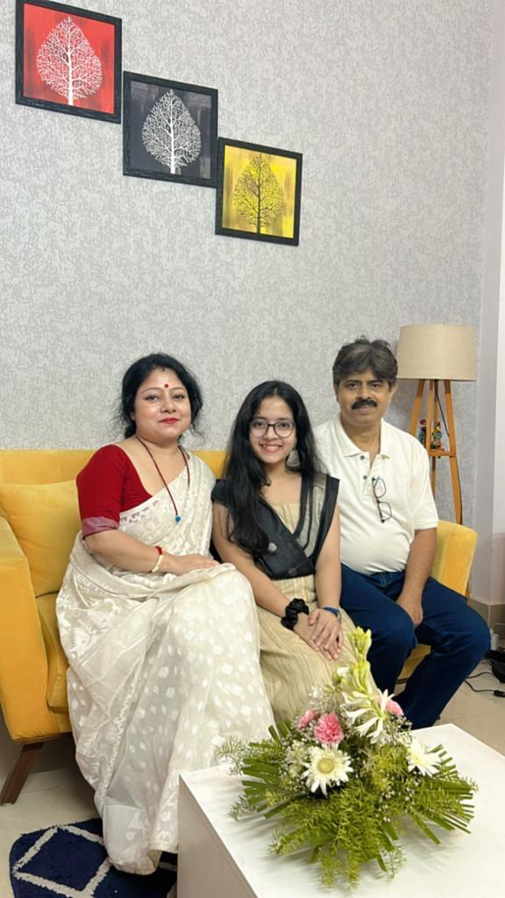
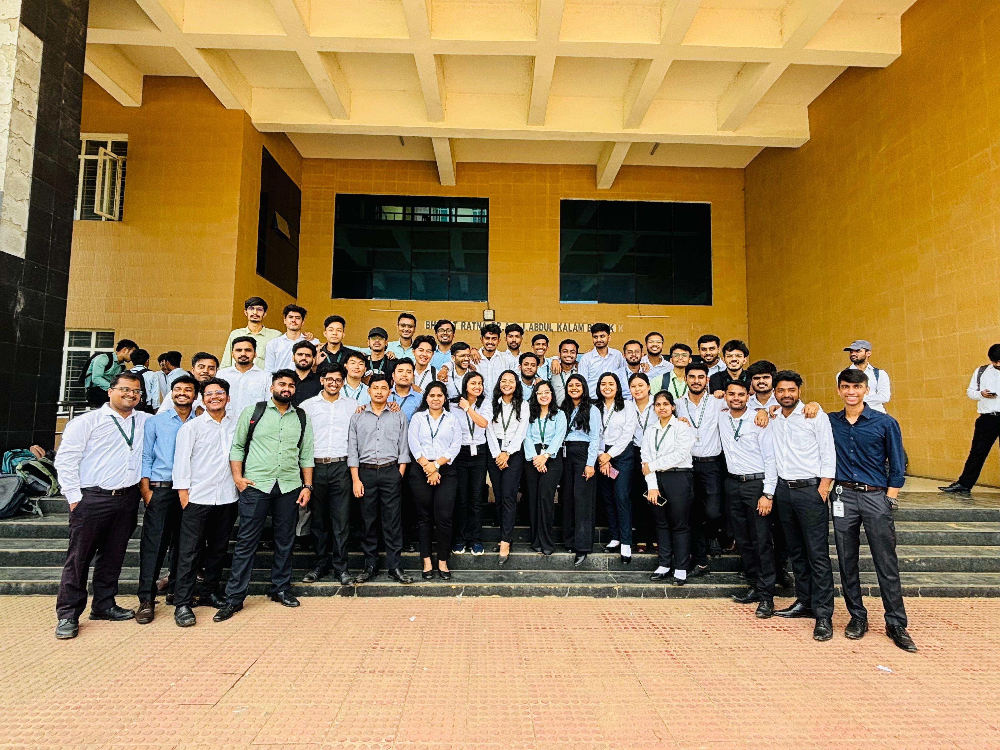
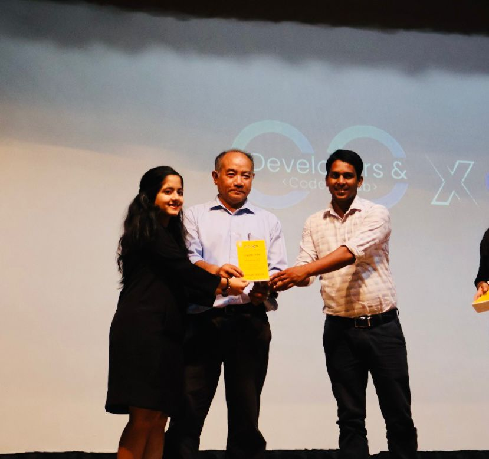
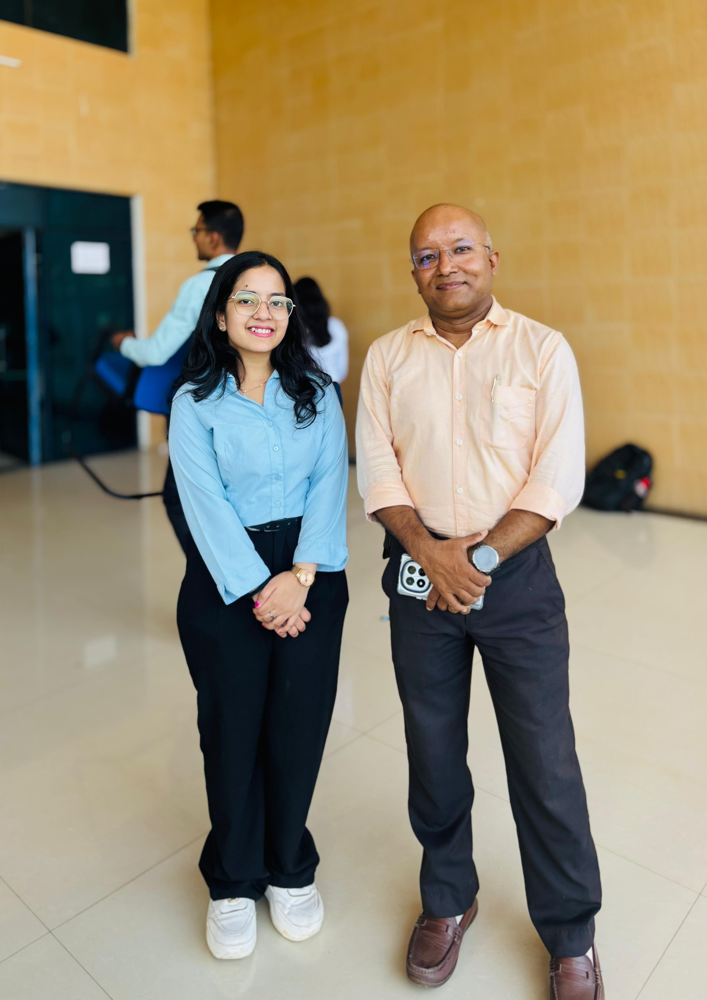
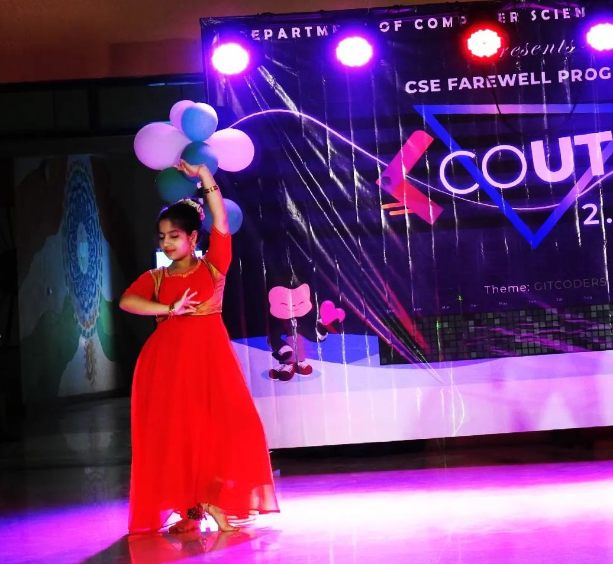

The board topper, third in the North East, achieving feats in Olympiads from a young age, an engaged batch topper in the first year, GDSC Lead, BTC Technical Lead, interned at Microsoft and Amazon, offers from JP Morgan and Airtel, Student of the Year 2025, first from my batch to get placed in 3rd year, and currently placed at Microsoft while looking out for a lot of things I would still love to explore. This is my story — the story of Sinjini Roy.

### Early pivot to engineering

Engineering was the last thing on my mind, even up to my 10th and 11th. I was like, anything I choose, it'll be anything but engineering. I was never interested in engineering because in my family and nearby also, many people were already in that profession, and I didn't want to go for the common path. Either it would be medical or something different, maybe UPSC. I wanted to do something unique, not the common one.

But I always had an interest in maths. I used to participate in Olympiads and those logic-building questions fascinated me, even though I had never really done coding before. The turning point was after my 10th boards, especially in my maths board exam. That gave me the confidence that I could go into engineering, because I could do well.

COVID changed everything. I was preparing for both medical and engineering, having Physics, Chemistry, Bio, and Maths. During the COVID phase, our batch had that online shift in 2021. I lost my interest in Bio and shifted my focus. I couldn't sit for my JEE Advanced exam because I had COVID. I was preparing for Advanced, but I couldn't give the exam at all. Repeating wasn't an option for me because I was worried about becoming more depressed. Whatever I was getting, I decided I should take it.

### Early college mindset

Initially, I wasn't very happy with this college. No one is happy with their college at first, especially when you don't want to be in your home state. But I kept myself motivated that no matter which college I joined, I had to perform my best wherever I was. There was no option to just be average. I had to try and be the best version of myself.

I wouldn't call my academic achievement naturally gifted — hard work was definitely there. The credit goes to my mother, who's a professor of maths and science. I've always been in that background where I had to score well, I had to be the topper. I've been under that pressure since childhood with the constant expectation to come first in class and maintain that position. It's not like it came from nothing — it's all my parents' support and contribution.

### Clubs, community, and leadership

I had this clear in my head: I wasn't doing clubs just to flaunt a tag. In my second year, I explored it all — technical clubs, cultural clubs, and even leadership prospects. I was actively volunteering and organizing events. I was that person who'd be in class in the morning, coding with the club in the afternoon, and rehearsing for a dance or drama by night. It was crazy, but fulfilling.

Beyond clubs, my focus remained on coding 100%. I knew that for Computer Science, I needed to master this one skill. I had fallen in love with it — the logic, the problem-solving, the adrenaline rush of solving a bug at 2 AM was addictive! I poured my second year into DSA and problem-solving. My core group from the coding club helped immensely. We were about 7–8 people, a very strong, focused group who would regularly participate in contests and grind LeetCode and Codeforces.

I didn't apply for Gymkhana elections at all, and that was a conscious decision. In our institute, there's this unspoken policy: if you want to become a placement coordinator, you're not supposed to hold any official post in Gymkhana. I had already decided that I wanted to become an Internship Coordinator, so I didn't want to risk my eligibility. Plus, I was already the GDSC President, and that role was intense.

The turning point came when my close friend, who became GS Technical, reached out about forming the Technical Community under Gymkhana. I saw a purpose, not just a position. The initiative had clear goals: building a technically strong student community, organizing real contests, helping our college's technical rankings improve, and giving technically skilled students actual visibility.

BTC's vision was to fix the gap in our college's technical culture. We kill it in cultural events, but when it comes to technical fests, contests, or competitive coding culture, there's a visible gap. We don't host enough competitions or give our technically brilliant students the platform they deserve. BTC was formed late, around October–November, so we had to move fast and smart with barely 3–4 months of real execution time starting January.

We managed some wins I'm proud of, like bringing high-profile people to our college and professionalizing how events were organized. We had a major plan for the Tech Conclave, inviting all the IITs and NITs from the Northeast to create a "Tech Kumbh Mela" for the Northeast. We even got verbal approval from the Director, but budget and time were major roadblocks. The budget process in our college is painfully slow, and by the time something gets sanctioned, the event window has passed.

### Building things and startup curiosity

I was inclined towards entrepreneurship, always curious about startups and solving real problems. But I never formally joined the E-Cell. There was this practical side of me saying that I was already knee-deep in the coding club, and joining another heavy-duty club might get overwhelming and counterproductive. So I stuck with DCC and BTC, where we had the freedom to ideate and build.

For GDSC, I had high hopes and mentored a few juniors. But somehow, nobody from the 2026 batch got selected, and I even got a mail saying "No one from your campus selected," which really stung. GDSC's selection process is very different — it's through Google's own external process with two rounds of interviews, an online application, plus assessment of technical, communication, and writing skills. I hope someone from the 2027 or 2028 batch brings GDSC back because it has insane potential.

Some changes I want to see in Gymkhana would be student voting. I genuinely believe students should have a say in who represents them. Right now, selections are heavily influenced by connections. There's also this fog between Gymkhana and students — no one really knows what's being planned, how money is being spent, or why some decisions are made. Students should know where the budget goes and what events are being planned.

As a suggestion to juniors, I want to say that every student should engage in at least one technical club. BTC played a huge role in my coding journey, giving me structure, motivation, and peer learning. If you look at someone who's been in technical clubs and compare them with someone who's stayed disconnected, you'll feel the difference in confidence, team skills, and projects. Don't waste these college years — they don't come back. College is not just CGPA and placements; it's your personal version update.

We brainstormed a lot as a team — an example could be the Moksha website. Then there was one personal favorite, around third year when four friends and I started building a placement preparation platform for our college. The idea was creating a platform where final-year seniors could upload their structured interview experiences for future batches. We built a full-stack app for it, but sadly couldn't push it into proper adoption due to placement pressure. There's this invisible wall between batches, and that's what we wanted to fix.

### Placements, hackathons, and internships

Placement pressure really kicks in around third year when internship season starts. This year was honestly better than expected, especially considering the current market situation. Tech hiring has shrunk globally, but our college punched above its weight with people landing strong offers both on-campus and off-campus.

What helped me personally was networking constantly with seniors and being plugged into the info flow. Hackathons were my career's secret weapon — JP Morgan, Airtel SheCodes, ServiceNow, Amazon. I got finalist positions and even full-time offers from two of them in my third year itself. Airtel offered a 15+ LPA package, and securing it a year before placements began was total stress relief. When you enter placement season with a PPO already in hand, your confidence is unshakable.

I've been at Amazon for about five months now as an intern, and it's pretty close to the real full-time experience with critical tasks, code going live, and real accountability. College life shaped me in ways that helped — club work taught me stakeholder management, communication, and the ability to reach out and collaborate. In corporate, work is serious but not suffocating, managers are chill but expect accountability, and you get freedom but better deliver.

College wasn't just labs and deadlines — it was people who made it worth it. My closest friends came from the coding club, and the alumni connections helped push me forward when I needed that extra shove. There was also Dr. Suman Deb — people might have diverse opinions, but for me, he was an academic mentor who showed up when it mattered.

### Pride and vision for NIT Agartala

Finally, I won't shy away from saying that I am proud of my college — I'm proud of NIT Agartala. We've proven we can stand with the big leagues in off-campus placements, open-source contributions, coding culture. We're not underdogs anymore — we're contenders. But we've still got a long way to go.

In 10–15 years, I want to see my college with infrastructure that matches potential with any other NIT or IIT. We could also have an exam centre — every NIT has a proper digital test centre. We don't. Internet lags during crucial tests shouldn't define someone's future. Fix that. Make sure students don't fight tech glitches more than they fight GRE or GATE questions.

Also, one more thing I want to strongly point out here is that girls deserve space, not just quotas. In-time rules? 10 PM is generous compared to other colleges, but let's be honest — true equality isn't curfews with better timings. It's trust, it's safety, and it's agency. Stop shielding, start empowering. Also, more girls in sports. In clubs. In core positions. In technical teams. They're killing it already — now just give them the stage.

### Memories that shaped me

Hosting my first college event — trembling hands, but once I held the mic, there was no turning back. Student of the Year — couldn't be there in person, but the title still hits hard. Late hostel nights — returning after club work, grabbing food at midnight, running from guards — peak nostalgia unlocked. Near-certification privileges — perks of being club-core, when you have to convince faculty and run programs and sometimes fudge a few forms (with love and stress).

In the toughest days, I was driven by the belief that if not me, then who? I always reminded myself that every student is facing challenges, so the only edge I could maintain was how I responded to those challenges. My family, especially my mom, provided constant support, and thinking about how hard she worked to give me a shot at a better life always brought me back on track.

One time someone asked me, “If a movie was made about your life, what would be the title?” It was during a pretty stressful time, right around internship prep, but that question stuck with me. I think now, I’d name it Ctrl+Alt+Achieve — because I had to control my self-doubt, alter my path entirely, and then slowly achieve what felt impossible at the beginning.

### Looking ahead

I still have dreams beyond just a job. I'm very passionate about education and mentoring, and I'd love to give back through ed-tech someday or by helping students from remote places who don't even know what's possible yet. Right now, I'm set to join Microsoft full-time, and my focus is on learning the craft. Entrepreneurship tempts me, but I'm not arrogant enough to say I'm ready for that today. Higher studies maybe, but honestly, I'm okay with not knowing.

I'd like to be remembered as someone who made an impact on a good number of people in college and inspired people. Not for titles, but for showing up. Someone whose kindness didn’t depend on position.

### For juniors: notes from my journey

- Start broad, then focus: You can do everything — just not all at once. Explore widely in first year; by second year, zoom in; by third year, double down.
- Take the first leap: Jump in even when you feel useless. Don't wait to "feel ready." Apply, fail, learn, repeat.
- Build your circle: Surround yourself with people who push you forward. The right group compounds your growth.
- Act before confidence: Confidence follows action, not the other way around.
- Be visible: Build LinkedIn, network with seniors, participate like mad. When opportunity knocks, don't ask "Who's there?" — open the door.

It's all cumulative pressure that builds over time. But it starts with action — not skill, not confidence. Also, build your people. A good group will either push you to excellence or drain you into burnout. Choose them wisely. And lastly, don't wait to be "ready." Start now. Confidence doesn't come first; action does.

If I had to wrap it up in one sentence: build LinkedIn, network with seniors, participate like mad, fail shamelessly. And when opportunity knocks, don't say "Who's there?" Just open the door.

### What truly matters to me

I'd like to be remembered as someone who made an impact — not on spreadsheets or leaderboards — but on people. Someone who inspired quietly and helped others rise. Not because of some title I held, but because I showed up. For my team. For my friends. For juniors. Someone who didn't just chase dreams, but built stepping stones for others to climb too. Not a club president. Not just a coder. But someone whose kindness didn't depend on positions.

If you asked what pushed me through every storm, every rough patch, every late night — it's simple. "Maa-Baap ke chehre pe garv dekhna." Seeing pride in their eyes — that was the prize. Still is. Always will be.

And with that, I think I've covered almost every corner of my college life — from first-year panic to final-year placement, club hustle to Amazon push. This story isn't just mine, it's for every student figuring it out day by day. I lived fully. I failed loudly. I learned quietly. And I loved it endlessly.

#### Piece written by - Harsh Srivastava
