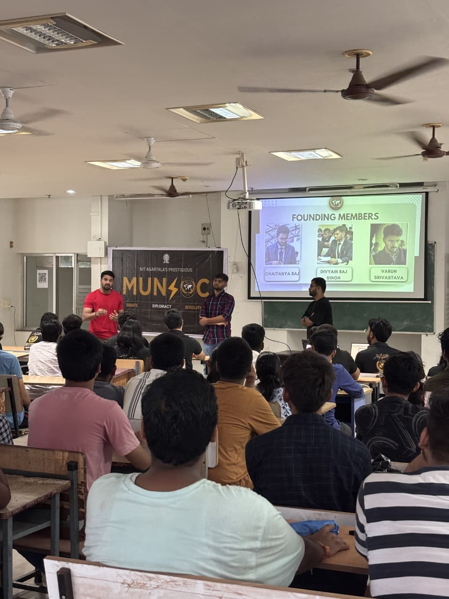
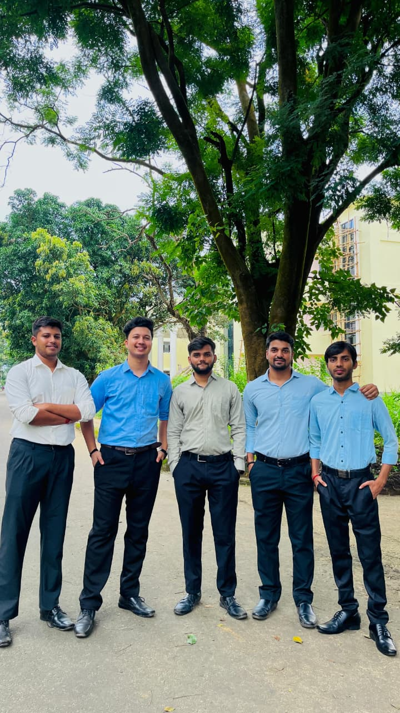
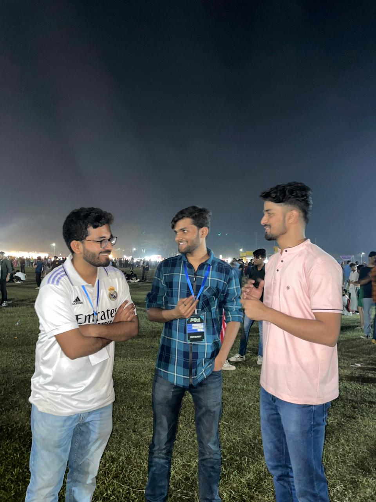
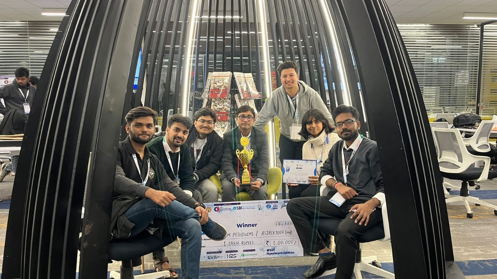
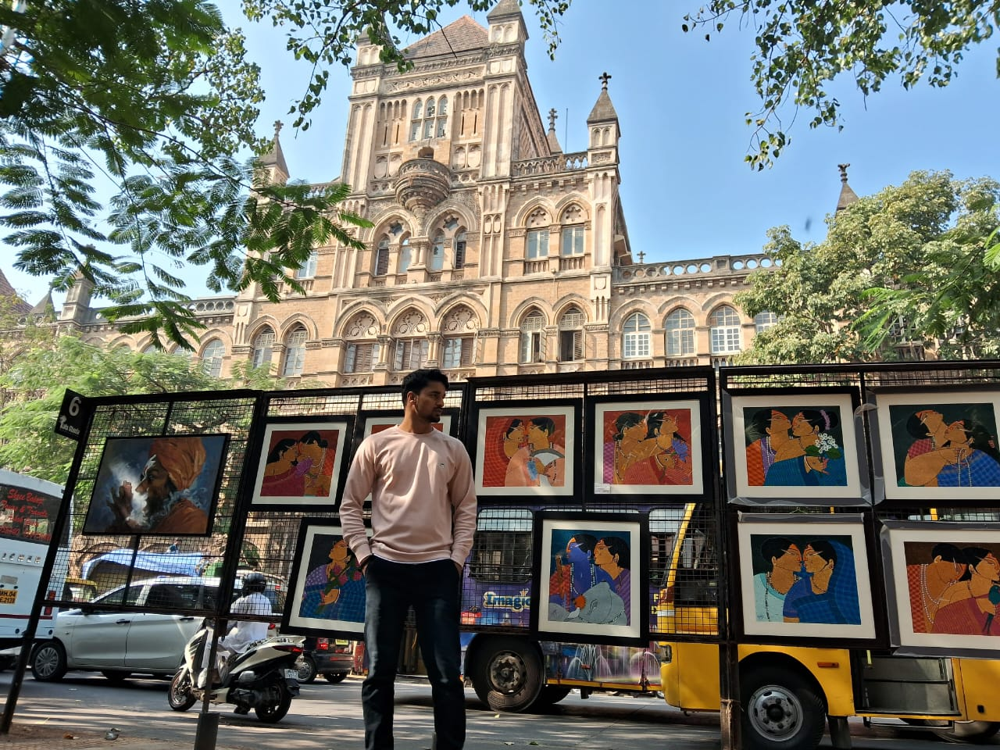

## **The Seeds of Curiosity**

A lot of leaders I met had arrived at engineering almost by accident;
few people actually plan that path. My heart wanted something else for a
long time, though that wasn\'t always obvious.\
\

## Early Life

Growing up in Prayagraj, I witnessed a beautiful coexistence of faiths
celebrating side by side. For me, learning was about practical
understanding. In class 10, just two days before my science pre-board
exam, Muharram was observed in my city. Instead of staying home to
study, I felt an irresistible pull to step outside and witness it to
observe the people, the emotions, and the rhythm of the crowd. Whenever
major events like the Kumbh took place, I would hop on my scooty and
immerse myself in the experience, trying to understand how society truly
functions beyond the pages of textbooks.

I first heard about the IITs through my elder siblings, they used to
talk about colleges. Engineering wasn\'t a common choice in my family.
Around class 8, my maternal cousin\'s college choice introduced me to
the idea of IIT. From classes 9 to 12 I didn\'t specifically prepare for
it, but in class 9 I joined Ramanujam coaching centre and dove into
reasoning and advanced physics beyond NCERT. Still, the JEE didn\'t feel
like the central goal of my life.

Everything shifted after my class 10 results, I scored 100 in Social
Science. That result made me realize I\'d always been more inclined
toward social studies.

Around the end of class 10, friends introduced me seriously to the JEE.
My friend Vinayak, whom I\'d known since class 1, helped me see that JEE
was worth attempting. In class 11 I joined Aakash Institute with Divyam.
We studied together.

When results came, I qualified for JEE but only for NIT. I decided to
take a drop year, but Chemistry went terribly in JEE Advanced. Walking
out of the exam centre I instinctively knew I wouldn\'t clear it. The
centre was 12 kilometres away; I walked 5-6 kilometres back in shock,
processing that failure step by step. Many first-year NIT students spend
months recovering from not clearing Advanced, but I processed most of it
during that walk.

For three or four days after reaching home, I felt broken. Then my
sister said something that changed my outlook: I could see this
positively or negatively. Negativity would give me nothing. Facing a
huge failure at a young age itself was a kind of learning. It took about
a week to recover.

After that I felt aimless. Most of my school friends had moved ahead to
IITs and other places. After two or three months, Divyam, who handled
the crisis better, became my support. I was ready to leave engineering
for a BA in Political Science or History, but Divyam convinced me to
attend counselling. We thought, \"We need to figure this out together.\"

Both of us got NITA, Electrical for me and Civil for him. I remember
being on the bus from Lucknow to Prayagraj when results came; relief
washed over me knowing I wouldn\'t be going alone. I researched
Agartala, found it similar to Prayagraj, and learned the college was
decent. I accepted it and came to NIT Agartala.

## **Finding Home Away from Home**

But reality hit fast. When I entered campus with my father, within days
I realized I was truly on my own for the first time. Even with a
roommate there\'s a distinct feeling of being alone. There\'s freedom
and opportunity, but no immediate support system. Still, I discovered
that friends can become family. My roommate Vasu and I bonded over our
shared setbacks and the stories of how we\'d ended up here. For the
first month or two, most conversations centred on those disappointments.

We didn\'t explore much initially: Divyam dove into coding, while I
tried web development, app development, and DSA nothing felt right.
Eventually I focused on Electrical, which felt familiar because I\'d
made small projects since childhood.

In every circle, you encounter two kinds of people. The first corrects
you instantly, The second allows you the space to make mistakes and
learn through them. For me, Chaitanya Bhaiya was that second kind. Much
of what I\'ve been able to build stems from people like him who trusted
me enough to let me grow. Both types are essential in life, but the
latter those who guide with patience rather than correction are truly
rare.

When NLC events began, there were discussions about participating in
MUN. I didn\'t know what MUN was at first. We were going to Guwahati for
the first time and I was allocated Bangladesh as my first country. In
first year emotions run high, so I connected deeply by reading their
constitution, understanding their problems. MUN resonated with my
interests. I met incredible delegates like David Das and Chaitanya
Bhaiya. I didn\'t win prizes initially, but performing alongside such
people taught me a lot. Debating is an art in which small details matter
even the way you raise your placard to speak.

After Guwahati, I wanted to explore more MUNs and push my boundaries
further. We decided to aim higher, and IIT Bhubaneswar was the next
destination. Chaitanya Bhaiya trained Divyam and me in the concept of
double delegation, preparing us thoroughly for the challenge ahead. Our
efforts paid off when we won High Commendation there. I still remember
his call after the results he asked, \"Why didn\'t you get Best
Delegate?\" That question stayed with me. It made me realize that one
achievement should never be the end point; you must always keep striving
for the next.

This became the founding principle of MUNSOC: never settle for less. We
aimed beyond institute-level recognition and built a structured platform
for debating and MUNs at NITA. We partnered with several NITs, IITs, and
even international MUN societies, formalizing collaborations through
MoUs. These efforts not only inspired other clubs but also strengthened
the culture of inter-institute collaboration across campuses.

The journey was challenging. Establishing a club means dealing with
technicalities and paperwork; many people have ideas but don\'t know the
process. The faculty-in-charge plays a huge role. We were fortunate to
have Gyanabati ma\'am, who understood our vision. When she saw that we
travelled and brought back prizes without institutional help, she felt
inspired and helped greatly with documentation. Still, Divyam, Chaitanya
Bhaiya and I spent nights making the paperwork. We learned the
importance of college connections and strong senior-junior bonds.

When it came to campus culture, I never supported the idea of ragging or
so-called \"intros.\" I\'ve always believed that real respect cannot be
demanded --- it has to come naturally. A simple, genuine greeting from a
junior means far more than forced formality. From the very beginning,
MUNSOC upheld that belief by maintaining a culture of mutual respect and
healthy senior--junior dynamics.

## **The Evolution of a Leader**

My first year went by in a blur. By second year, I began taking on
leadership roles and that\'s when I figured out a pattern: first year is
for exploring, second for achieving, third for giving back, and fourth
for \"sanyas\", placements and peace!

Too many students join clubs in second year and vanish soon after.
That\'s a missed opportunity both for them and for the campus. My
mantra\'s simple: don\'t complain about ten problems; fix two of them.
Small wins compound faster than you think.

That mindset drove us to bring new energy to NIT Agartala\'s campus
culture and reconnect with our alumni. Many said, \"Our alumni don\'t
care.\" Instead of repeating that, Harish, Kuldeep, and I decided to
change it. Maybe we didn\'t fix everything, but we definitely started
something. As Simon Sinek says, \"Leadership is not about being in
charge. It\'s about taking care of those in your charge.\"

I explored coding, DSA, and circuits until I realized my interests were
wired differently. MUNSOC\'s discussions on society and policy felt like
home. That\'s where I discovered that I was drawn more toward strategy
and human behavior than to software or machines.

Leadership, to me, was never about titles, it was about impact. At
MUNSOC, everyone focused on contribution, not competition. Later, as
Charge D\'Affairs, I kept asking myself: How can I add value from where
I stand?

As Internship Coordinator, I once heard someone say NIT Silchar had
stronger placements than us despite our better infrastructure. The
difference? Alumni engagement. That\'s when it clicked that Gymkhana
should be the bridge between students and alumni.

We started alumni seminars where they asked students, \"What can we do
for you?\" It was a small step, but a meaningful one. Many saw Gymkhana
as a \"dummy body,\" but I saw it as a platform for real change if used
with purpose.

People often say, \"There\'s no time for clubs and academics.\" But if
you can scroll for hours, you can manage both. Study smart, not nonstop.
One week of focused prep can handle exams. Join clubs, meet people,
explore ideas, that\'s where true learning happens.

Leadership taught me one thing: One can make headlines; many can make
history. It\'s not about being the loudest voice, it\'s about being the
one who quietly makes things work.

## **Beyond the Classroom**

Projects matter but there\'s no universal \"placement project.\" It
depends entirely on your target domain. Ideally, every student should
maintain two resumes: one for their core branch and one for IT/software,
each backed by at least one strong project.

For my core profile, I worked on a Smart India Hackathon (SIH) project,
building a chlorine and silver ion testing kit for water safety. It
taught me a golden rule: every project must have a \"why.\" Interviewers
rarely care about complex circuits or algorithms unless you can explain
why you built it and who it helps.

When it comes to placements, let\'s be honest, patience is the real
skill test. Discuss with seniors, know where you stand, and be ready for
rejection without losing rhythm. Communication skills are the silent
deal-breaker; clearing technical rounds only to fumble in HR because you
\"couldn\'t phrase it right\" is a heartbreak too many face. Also,
don\'t limit yourself to campus drives, off-campus is where hustle meets
opportunity.

Then came the case study part, post-COVID, this culture exploded, with
many offering PPI opportunities. My first exposure was IIT Kanpur\'s
\"Rajniti\", which analyzed why women\'s representation in governance
lags despite constitutional promises. Later, my friend Sumit and I won a
national case study competition organised by A1 Fence. What began as
casual brainstorming turned into caffeine-fueled nights of strategy.
Events like SIH matter too, they tackle real government problems and
even influence NIRF rankings.

Beyond the technical grind, my compass pointed toward social impact and
policy. For over five years, I\'ve worked with Shuruaat Ek Jyoti Shiksha
Ki, an NGO in Prayagraj founded by Abhishek sir, which runs a free
school for underprivileged children. Through Think India, I also worked
with Shiv Ganga Jhabua in Madhya Pradesh on rural tribal development.
These experiences taught me something engineering often misses, we build
IQ, but forget EQ.

Living among the Bhil tribes in Jhabua was eye-opening. They may not use
fancy tech, but in sustainable development, they\'re leagues ahead ---
protecting the environment while growing collectively. Their way of
passing on wisdom showed me that education must be regionally rooted and
culturally aware, something our NEP is finally emphasizing.

## **The Vision Forward**

Looking ahead ten years, I envision transformation in three key areas.

First, learning won\'t be confined to lecture halls, students will learn
by building, experimenting, and leading initiatives that solve societal
challenges.

Second, I imagine a networked campus, where alumni, industry, and
academia work seamlessly with mentorship, funding, and innovation
flowing in all directions.

Third, I dream of an Innovation Commons, a 24×7 creative hub where any
student with an idea can walk in, find a mentor, print a prototype, and
turn imagination into impact.

Equally crucial is building strong alumni connections for mentorship,
placements, and financial support. Through SARC, our vision is to create
a sustainable system that first channels meaningful alumni contributions
and later expands to fund student projects, empower clubs, and enhance
the institute\'s national visibility.

At present, alumni engagement lacks accessible avenues. One initiative
we\'re exploring is an Alumni Card, a subscription model, perhaps ₹5,000
annually, that grants alumni access to institute facilities and
networks. Regular global alumni meets and batch reunions should also be
institutionalized, with event announcements made three to four months in
advance for better participation.

Of course, none of this was a solo effort. I\'ve been fortunate to have
incredible friends, Sumit, Divyam, Chaitanya Bhaiya, Vasu, Dhruv,
Harish, Pawan, Aman and Kuldeep and seniors like Manish Bhaiya, Rajiv
Bhaiya, and Avinash Bhaiya, whose guidance shaped every step of this
journey also my elder brother Yash Bhaiya has been my anchor the one who
stood by me through every challenge, encouraged every initiative I took,
and believed in me even when I doubted myself.

## **A Legacy of Values**

When people ask, \"Where do you see yourself in ten years?\" I usually
say, hopefully not bald from stress or broke from passion projects. I
just want to be stable enough to sleep peacefully, yet restless enough
to wake up with purpose. No quiet mornings with tea and newspapers for
me, I\'d rather still be chasing ideas that keep life exciting.

Currently Placed in an IT Firm, though I remain deeply drawn to social
studies and policy. If someday I find my corporate role doesn\'t offer
the depth of meaning I seek, I\'ll pivot, toward NGOs, policy, or civil
service. Whatever the path, the goal remains the same: to create value
and drive positive change.

When asked how I\'d like to be remembered, I don\'t think in terms of
personal fame. I\'d rather be remembered for building something that
outlives me a culture of collaboration, responsibility, and purpose. If
the systems or initiatives we began continue helping others identify
problems, take ownership, and act meaningfully, that would be the true
legacy.

Because in the end, legacies aren\'t built from names, they\'re built
from values that endure, and the spirit of teamwork that keeps them
alive.

_Piece written by - Dattatreya Datta._
